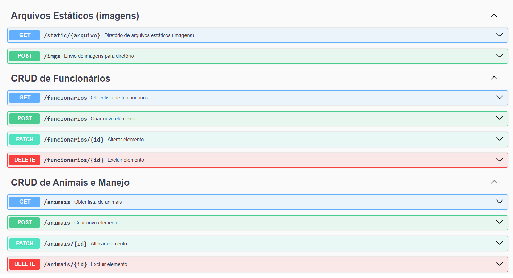

<h1 align="center">AGROTECH</h1>

<p align="center">🚀 Projeto que utiliza o json-server para mockar uma REST API e Swagger para documentar, também cria um diretório para upload de imagem e utiliza autenticação JWT</p><br>

- [json-server Authentication ](https://www.npmjs.com/package/json-server-auth)
- [Swagger](https://swagger.io/)

### Descrição
Este projeto utiliza como base o json-server

### Pré-requisitos e Como utilizar
Antes de começar, você vai precisar ter instalado em sua máquina as seguintes ferramentas:
[Git](https://git-scm.com), [Node.js](https://nodejs.org/en/). 
Além disto é bom ter um editor para trabalhar com o código como [VSCode](https://code.visualstudio.com/)

### 👨🏽‍💻 Rodando o Back End (servidor)
#### Clone este repositório, abra com VsCode e em um terminal bash

```bash
# Instale as dependências
$ npm install

# Execute a aplicação 
$ npm start
# O servidor inciará na porta:3000 - acesse <http://localhost:3000/swagger> para ver a documentação
```
- A API possui autenticação JWT, para acessar os endpoints protegidos é necessário passar o token no header da requisição
- Basta criar um usuário na rota /users e fazer login na rota /login para obter o token
- Exemplo de dados para a criação de um usuário:
```json
{
    "nome": "Marcos",
    "email": "marcos@gmailcom",
    "password": "senha123"
}
```
